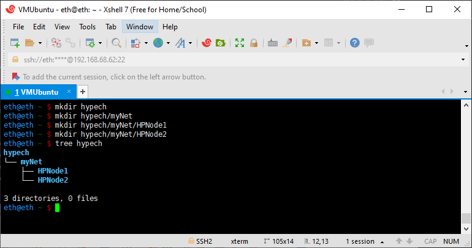
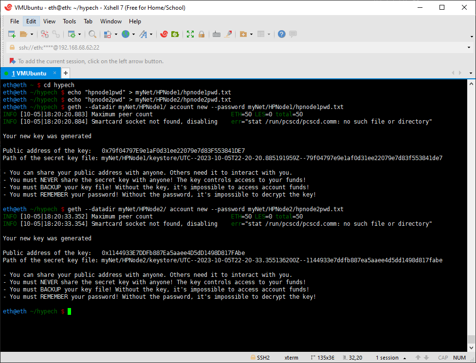
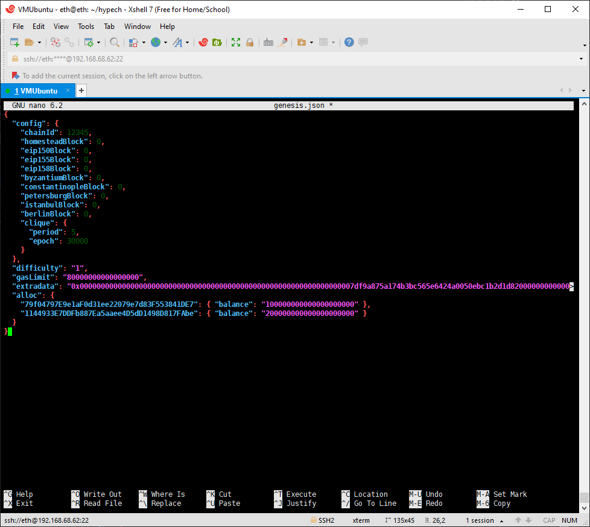

## Chapter 2. Build up one Ethereum Network at Your Home

The best learning strategy is just do it. Before we use real money to jump into the crucial Ethereum world, we will build up one mimic Ethereum network in our home. We will continue Ethereum journey after become familar with all the concepts and tricks. Find a couple of spared computers or laptops, we run build and run an Ethereum at home.

I found 3 old computers from my basement. I'm going to setup my Ethereum with them.

1. 5 years old HP Pavilion desktop with i7-8700, 16G RAM, 1T Harddrive, 120G SSD. 
2. 6 years old Macbook Pro.
3. 9 years old Lenovo V330 Laptop. 

The Windows 11 is too slow in the old computer. I changed them to Windows Server 2022 (it's not necessary if you have a faster computer or you don't mind waiting). The Windows OS is installed on the 1T harddrive. 

On top of Windows Server 2022, download VMWare Workstation 17. Create a new Virtual Machine and install Ubuntu 14.04. The virtual machine is installed on 120G SSD.

The plan is building an Ethereum network with these 3 computers, then conduct all the transactions or other functions same with real ETH2.0 network. 

We'll start from the HP Pavilion. I will set up our home private Ethereum network of two nodes in HP. Both nodes will run on the my HP Desktop. Below is a step-by-step instruction to build our own Ethereum network. 


**Table of content:**
- [Step 1. Setup Directory Structure](#directory)
- [Step 2. Create New Accounts](#newaccount)
- [Step 3. Genesis Block](#genesieblock)
- [Step 4. Initializing the Geth Database](#initializegeth)

<a id="directory"></a>
### Step 1. Setup Directory Structure
The data directories in HP Desktop for each node will be named <span style="background-color:green">HPNode1</span> and <span style="background-color:green">HPNode2</span>. 

The HP is running Ubuntu in VMWare. After starting Ubuntu, use Xshell to connect it from Windows. 

```
mkdir hypech
mkdir hypech/myNet
mkdir hypech/myNet/HPNode1
mkdir hypech/myNet/HPNode2
```


<a id="newaccount"></a>
### Step 2: Create Ethereum accounts. 
Each node is supposed to have one account connected. We will created one account for each node. To make the life easier, we store the password as a text file. 

```
cd hypech
echo "hpnode1pwd" > myNet/HPNode1/hpnode1pwd.txt
echo "hpnode2pwd" > myNet/HPNode2/hpnode2pwd.txt
geth --datadir myNet/HPNode1/ account new --password myNet/HPNode1/hpnode1pwd.txt
geth --datadir myNet/HPNode2/ account new --password myNet/HPNode2/hpnode2pwd.txt
```


Make note of the public key generated for each account, as it will be referenced in the genesis block configuration below.

`Public address of the key for HPNode1:   0x79f04797E9e1aF0d31ee22079e7d83F553841DE7`

`Public address of the key for HPNode2:   0x1144933E7DDFb887Ea5aaee4D5dD1498D817FAbe`

<a id="genesisblock"></a>
### Step 3: Genesis block

The first block of every Ethereum-based blockchain is known as the genesis block. Since we are not connected to the public Ethereum network, we have to create the genesis block by ourselves. In the case of Ethereum mainnet, the genesis block is [hard-coded](https://github.com/ethereum/go-ethereum/blob/master/core/genesis.go) into the `geth` source code. In the case of a private/custom `geth` network, the genesis block is configurable. Create a new file called `genesis.json` and insert the following. 
In Genesis block time, the ETH coins are assinged, not mined or through other ways. In our case, we assign 100 ETHs to HPNode1, and 200 ETHs to HPNode2. The ETH network by default is using wei as the units. One ETH equals 1 following 18 0s wei. That's why we have so many 0s in our code. 
Other parts have specific meaning. We'll get back it later. For now, just create this file using your favorite way. I use nano to creat it.

```
nano genesis.json
```


```json
{
  "config": {
    "chainId": 12345,
    "homesteadBlock": 0,
    "eip150Block": 0,
    "eip155Block": 0,
    "eip158Block": 0,
    "byzantiumBlock": 0,
    "constantinopleBlock": 0,
    "petersburgBlock": 0,
    "istanbulBlock": 0,
    "berlinBlock": 0,
    "clique": {
      "period": 5,
      "epoch": 30000
    }
  },
  "difficulty": "1",
  "gasLimit": "80000000000000000",
  "extradata": "0x00000000000000000000000000000000000000000000000000000000000000007df9a875a174b3bc565e6424a0050ebc1b2d1d820000000000000000000000000000000000000000000000000000000000000000000000000000000000000000000000000000000000000000000000000000000000",
  "alloc": {
    "79f04797E9e1aF0d31ee22079e7d83F553841DE7": { "balance": "100000000000000000000" },
    "1144933E7DDFb887Ea5aaee4D5dD1498D817FAbe": { "balance": "200000000000000000000" }
  }
}
```

Before moving to the next step, let's see what we've done so far:


<a id="initializegeth"></a>
### Step 4: Initializing the Geth Database
To create a blockchain node that uses this genesis block, first use geth init to import and sets the canonical genesis block for the new chain. This requires the path to genesis.json to be passed as an argument.

`geth init --datadir data genesis.json`

```
geth --datadir data/node1/ init genesis8.json
geth --datadir data/node2/ init genesis8.json
geth --datadir data/miner/ init genesis8.json
```

When Geth is started using --datadir data the genesis block defined in genesis.json will be used. For example:

`geth --datadir data/node1 --networkid 998101`

The default value for the storage scheme is hash. In case the plan is to use the path based storage scheme, the --state.scheme=path needs to be passed during the init step. This will ensure that the database is initialized with the correct storage scheme for the network.

`geth --state.scheme=path init --datadir data genesis.json`

### Step 5: Setting Up Networking

With the node configured and initialized, the next step is to set up a peer-to-peer network. This requires a bootstrap node. The bootstrap node is a normal node that is designated to be the entry point that other nodes use to join the network. Any node can be chosen to be the bootstrap node.

To configure a bootstrap node, the IP address of the machine the bootstrap node will run on must be known. The bootstrap node needs to know its own IP address so that it can broadcast it to other nodes. On a local machine this can be found using tools such as ifconfig and on cloud instances such as Amazon EC2 the IP address of the virtual machine can be found in the management console. Any firewalls must allow UDP and TCP traffic on port 30303.

The bootstrap node IP is set using the --nat flag (the command below contains an example address - replace it with the correct one).

`geth --datadir data --networkid 998101 --nat extip:192.168.68.62`

The 'node record' of the bootnode can be extracted using the JS console:

`geth attach --exec admin.nodeInfo.enr data/geth.ipc`

This command should print a base64 string such as the following example. Other nodes will use the information contained in the bootstrap node record to connect to the peer-to-peer network.
`"enr:-Ka4QN5bmTSIV7cU6mXp-wHC93A9oxm0vEiz2iDITY3UVAnAWHerzM6YPgtl9aCrMXjv-XaVJuu6urEKyZZ9R80gzwiGAYryhMp1g2V0aMrJhPxk7ASDEYwwgmlkgnY0gmlwhMCoRD6Jc2VjcDI1NmsxoQPe2Qzsd9ug79jvkPz9a1oIuJs4CAqazMpvgqAxlfS7HIRzbmFwwIN0Y3CCdl-DdWRwgnZf"
eth@eth ~/hypech/privatenetwork8 $`

`enr:-Je4QEiMeOxy_h0aweL2DtZmxnUMy-XPQcZllrMt_2V1lzynOwSx7GnjCf1k8BAsZD5dvHOBLuldzLYxpoD5UcqISiwDg2V0aMfGhGlQhqmAgmlkgnY0gmlwhKwQ_gSJc2VjcDI1NmsxoQKX_WLWgDKONsGvxtp9OeSIv2fRoGwu5vMtxfNGdut4cIN0Y3CCdl-DdWRwgnZf"`

If the nodes are intended to connect across the Internet, the bootnode and all other nodes must have public IP addresses assigned, and both TCP and UDP traffic can pass their firewalls. If Internet connectivity is not required or all member nodes connect using well-known IPs, Geth should be set up to restrict peer-to-peer connectivity to an IP subnet. Doing so will further isolate the network and prevents cross-connecting with other blockchain networks in case the nodes are reachable from the Internet. Use the --netrestrict flag to configure a whitelist of IP networks:

`geth <other-flags> --netrestrict 172.16.254.0/24`

With the above setting, Geth will only allow connections from the 172.16.254.0/24 subnet, and will not attempt to connect to other nodes outside of the set IP range.